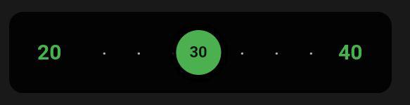

# Fluid Slider Flutter
The component created with [Flutter](https://flutter.dev/) using Dart programming language, inspired by [Fluid Slider by Ramotion](https://github.com/Ramotion/fluid-slider). 

## About
The component was created to better simulate all the component behavior in the inspiration video. The component is editable and only require the Flutter framework and no other third-party library.

### The App
The GIF below shows this current component running.


### Constructor
The component is called SliderBall in this project. The constructor is:

````
SliderBall(
      {
        this.backgroundColor = const Color(0xFF6168E7),
        this.borderRadius = const BorderRadius.all(Radius.circular(10)),
        this.initialValue,
        this.finalValue,
        this.textStyle = const TextStyle(color: Colors.white, fontSize: 15, fontWeight: FontWeight.bold),
        this.onSelectStart,
        this.onSelectEnd
      }
      ): assert(initialValue != null && finalValue != null), 
         assert(initialValue < finalValue), 
         assert(textStyle.fontSize != null);
````

* **backgroundColor(Color)**:
  The component background color. By default, if not specified, the background color is #6168E7.
* **borderRadius(BorderRadiusGeometry)**:
  The component body border radius. By default, if not specified, all the borders are set as circular with the value 10.
* **initialValue(int)**:
  The initial slider value.
* **finalValue(int)**:
  The final slider value.
* **textStyle(TextStyle)**:
  The text style to the initial and final values text. By default, if not specified, the style to this texts are with color white, font of size 15 and font weight bold.
* **onSelectStart(Function())**:
  This function is called when the user press the circle of the slider, that means, when the user intend to choose the slider value.
* **onSelectEnd(Function(int))**:
  This function is called when circle of the slider returns to middle, that means, when the user already chose the slider value.

### Example

#### Code
````
new SliderBall( 
  initialValue: 20, 
  finalValue: 40, 
  backgroundColor: Colors.black87, 
  textStyle: TextStyle(
    color: Colors.green, 
    fontSize: 15, 
    fontWeight: FontWeight.bold
  )
)
````
#### Result

